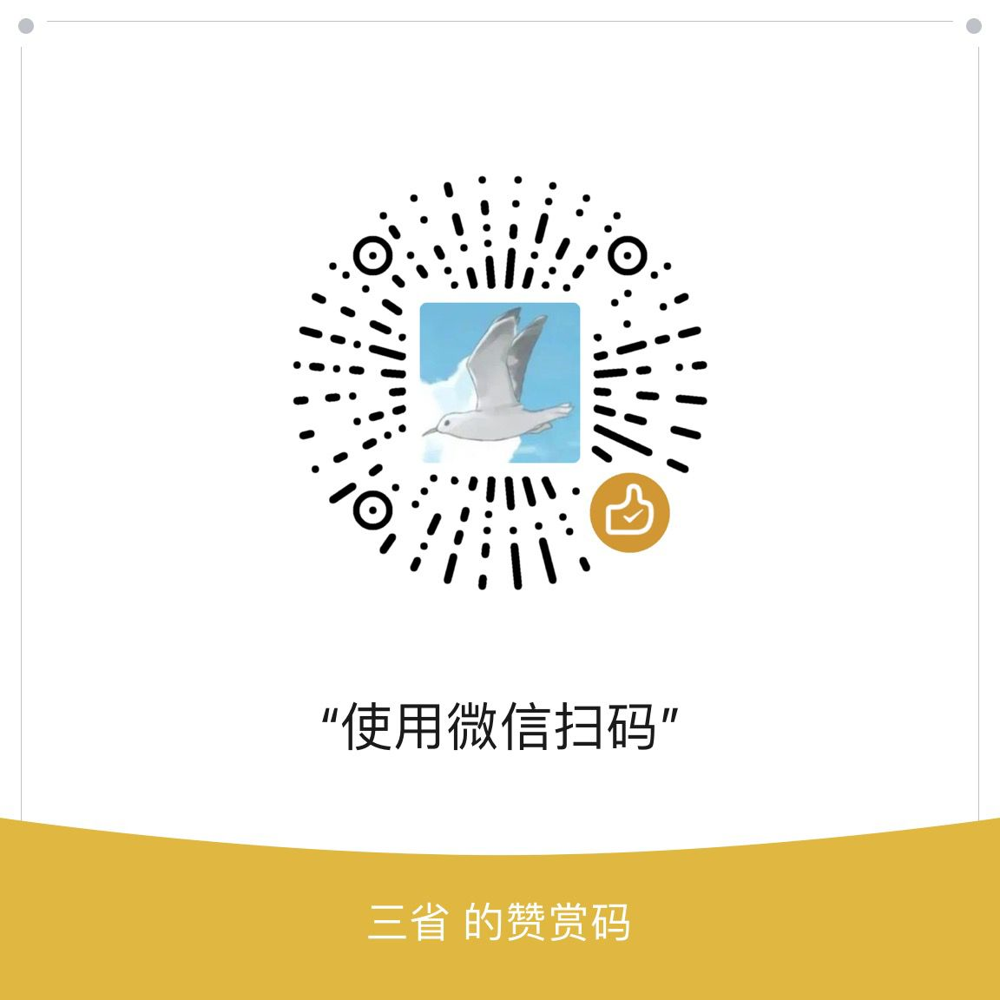

<h1 align="center">
  Hey there, it's Khalil
  
</h1>

  Glad you stopped by.

  
  
  
  

  
   
  Live from my Mac &middot; <a href="https://github.com/Yudaotor/nowplaying-workers">how it's wired up</a>

---

### What I'm building

**[Lyrimuse](https://github.com/Yudaotor/lyrimuse)** &middot; Swift

Word-synced desktop lyrics for macOS. Floating overlay, Dynamic Island, menu bar or
lyrics window &mdash; with translation, romanization and Last.fm scrobbling.
An actively maintained LyricsX alternative.

Works with Apple Music, Spotify, QQ Music, NetEase Cloud Music and Kugou,
plus YouTube Music and Spotify Web in any browser.

---

### GitHub at a glance

  <picture>
    <source media="(prefers-color-scheme: dark)" srcset="https://github-profile-summary-cards.vercel.app/api/cards/stats?username=Yudaotor&theme=github_dark">
    
  </picture>

  <picture>
    <source media="(prefers-color-scheme: dark)" srcset="https://streak-stats.demolab.com/?user=Yudaotor&theme=github-dark-blue&hide_border=true&date_format=M%20j%5B%2C%20Y%5D">
    
  </picture>

  <picture>
    <source media="(prefers-color-scheme: dark)" srcset="https://raw.githubusercontent.com/Yudaotor/Yudaotor/output/snake-dark.svg">
    
  </picture>

---

### Buy me a coffee

<table>
<tr>
<td align="center" width="33%"> WeChat</td>
<td align="center" width="33%"> Alipay</td>
<td align="center" width="33%">
    
  
    International
</td>
</tr>
</table>
